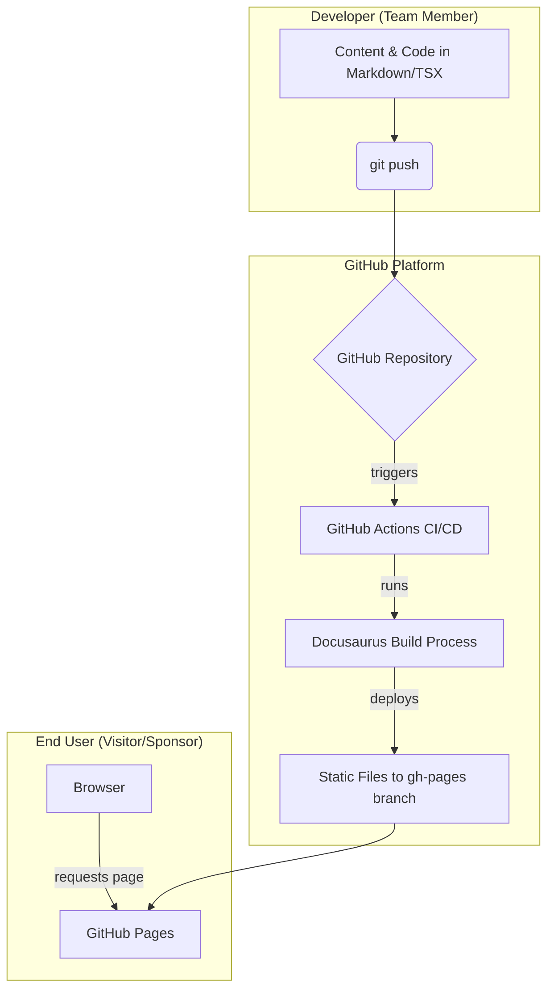
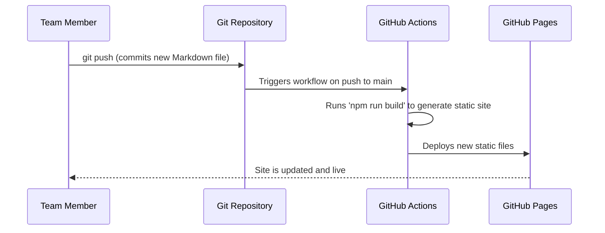

# Reprogrammed Team Website Fullstack Architecture Document

### **Introduction**

This document outlines the complete fullstack architecture for the Reprogrammed Team Website, including backend systems, frontend implementation, and their integration. It serves as the single source of truth for AI-driven development, ensuring consistency across the entire technology stack. This unified approach combines what would traditionally be separate backend and frontend architecture documents, streamlining the development process.

#### **Starter Template or Existing Project**

The project will be built upon the official **Docusaurus 'classic-typescript' starter template**. All architectural decisions will be made in the context of customizing and extending this existing foundation, rather than building from a completely blank slate.

#### **Change Log**

| Date       | Version | Description                                          | Author              |
| :--------- | :------ | :--------------------------------------------------- | :------------------ |
| 2025-08-15 | 1.0     | Initial architecture draft based on PRD and UX Spec. | Winston (Architect) |

---

### **High Level Architecture**

#### **Technical Summary**

The Reprogrammed team website will be built using a **Jamstack** architecture, leveraging **Static Site Generation (SSG)** for optimal performance, security, and low-cost scalability. The core of the project is a **Docusaurus** application written in **TypeScript**, which will be managed in a single **monorepo**. The entire build and deployment pipeline will be handled by **GitHub Actions** and hosted on **GitHub Pages**. This holistic approach ensures a simple, robust, and easily maintainable solution that directly supports the project's goals.

#### **Platform and Infrastructure Choice**

- **Platform**: **GitHub** will be the primary platform for the entire development lifecycle.
- **Key Services**:
  - **GitHub Repository**: For source code and content management.
  - **GitHub Actions**: For Continuous Integration and Continuous Deployment (CI/CD).
  - **GitHub Pages**: For free, high-performance hosting of the static website.

#### **Repository Structure**

- **Structure**: A **Monorepo** approach will be used, with the entire Docusaurus project (source code, content, configuration, and documentation) contained within a single Git repository.

#### **High Level Architecture Diagram**

This diagram illustrates the development and delivery workflow.



#### **Architectural Patterns**

- **Jamstack / Static Site Generation (SSG)**: This is the primary architectural pattern.
  - **Rationale**: Provides superior performance, enhanced security (no live database or server to attack), and leverages a free, scalable hosting platform (GitHub Pages), which is ideal for a project with no budget.
- **Monorepo**: The entire project will be self-contained in one repository.
  - **Rationale**: Simplifies the build process, dependency management, and content updates for a unified Docusaurus application.

---

### **Tech Stack**

| Category           | Technology                   | Version            | Purpose                                       | Rationale                                                                    |
| :----------------- | :--------------------------- | :----------------- | :-------------------------------------------- | :--------------------------------------------------------------------------- |
| Frontend Language  | TypeScript                   | `5.5.3`            | Provides static typing for the project.       | Enhances code quality and maintainability.                                   |
| Frontend Framework | Docusaurus (React)           | `3.4.0` (`18.3.1`) | The core static site generation framework.    | Chosen for its excellent documentation features, blog, and customizability.  |
| Styling            | Infima CSS Framework         | (Bundled)          | The default styling framework for Docusaurus. | Provides a consistent and clean UI out-of-the-box, speeding up development.  |
| Frontend Testing   | Jest / React Testing Library | `29.7.0`           | For unit testing custom React components.     | The standard testing suite for Docusaurus and React applications.            |
| CI/CD              | GitHub Actions               | (N/A)              | Automates the build and deployment process.   | Natively integrated with the GitHub repository and free for public projects. |
| Hosting            | GitHub Pages                 | (N/A)              | Hosts the static website.                     | Provides free, fast, and reliable hosting directly from the repository.      |
| Package Manager    | npm                          | `10.8.1`           | Manages project dependencies.                 | The default package manager for Node.js projects.                            |

---

### **Data Models**

#### **BlogPost**

- **Purpose**: To define the structure and metadata for each blog post. This will be managed via Markdown frontmatter.
- **Key Attributes**:
  - `title`: `string` - The main title of the blog post.
  - `date`: `string` - The publication date (e.g., '2025-08-15').
  - `author`: `string` - The name of the team member who wrote the post.
  - `tags`: `string[]` - A list of relevant tags (e.g., ['build-season', 'competition']).
  - `slug`: `string` - The URL-friendly version of the title.
  - `draft`: `boolean` - If `true`, the post will not be published to the live site.
- **TypeScript Interface**:

<!-- end list -->

```typescript
interface BlogPost {
  title: string;
  date: string;
  author: string;
  tags: string[];
  slug: string;
  draft?: boolean;
}
```

---

#### **Sponsor**

- **Purpose**: To define the structure for displaying sponsor information consistently.
- **Key Attributes**:
  - `name`: `string` - The official name of the sponsor.
  - `logoUrl`: `string` - The path to the sponsor's logo image file.
  - `website`: `string` - A link to the sponsor's website.
  - `sponsorshipLevel`: `string` - The sponsorship tier (e.g., 'Gold', 'Silver').
- **TypeScript Interface**:

<!-- end list -->

```typescript
interface Sponsor {
  name: string;
  logoUrl: string;
  website: string;
  sponsorshipLevel: string;
}
```

---

### **API Specification**

This section is not applicable for this project. As defined in our **High Level Architecture** and **Tech Stack**, this project is being built as a **Static Site**. Static sites do not have a backend server or a dynamic API layer.

---

### **Components**

#### **1. Content Management Component**

- **Responsibility**: Manages all website content (blog posts, pages, resources) via Markdown files within the Git repository.
- **Key Interfaces**: The filesystem and Git workflow are the primary interfaces. Content is managed by editing `.md`/`.mdx` files.
- **Dependencies**: Relies on the Docusaurus Build Engine to parse and render the content.
- **Technology Stack**: Markdown, MDX, Git.

#### **2. Docusaurus Build Engine**

- **Responsibility**: Reads the Markdown content, data models, and React components, then compiles them into a complete, optimized static website (HTML, CSS, JS).
- **Key Interfaces**: Docusaurus CLI commands (e.g., `npm run build`).
- **Dependencies**: Requires a Node.js environment and depends on the Content Management component for its source files.
- **Technology Stack**: Docusaurus, React, Webpack, Node.js.

#### **3. UI & Presentation Layer**

- **Responsibility**: Provides the visual presentation and user interface for the website, including layout, styling, and interactive elements, based on the Infima framework.
- **Key Interfaces**: Renders content into HTML for the user's browser.
- **Dependencies**: Depends on the Docusaurus Build Engine to be compiled.
- **Technology Stack**: React, Infima CSS Framework, TypeScript.

#### **4. Deployment Pipeline**

- **Responsibility**: Automates the build and deployment of the static site to GitHub Pages whenever changes are pushed to the main branch.
- **Key Interfaces**: Triggered by `git push` events to the GitHub repository.
- **Dependencies**: Depends on the Docusaurus Build Engine to generate the production assets.
- **Technology Stack**: GitHub Actions.

#### **Component Interaction Diagram**

```mermaid
graph TD
    A[Content Management (Markdown/Git)] --> B[Docusaurus Build Engine];
    C[UI & Presentation Layer (React/Infima)] --> B;
    B --> D[Deployment Pipeline (GitHub Actions)];
    D --> E[Hosted Site (GitHub Pages)];
```

---

### **External APIs**

#### **YouTube Embedded Player**

- **Purpose**: To display the team's "how-to" videos and other video content directly on the Resources page.
- **Documentation**: [https://developers.google.com/youtube/player_parameters](https://developers.google.com/youtube/player_parameters)
- **Integration Method**: The site will use standard `<iframe>` embeds provided by YouTube. No API key is required.

#### **Static Form Provider (Example: Formspree)**

- **Purpose**: To handle submissions from the website's Contact page without needing a custom backend.
- **Documentation**: A specific provider will need to be chosen (e.g., Formspree, Netlify Forms).
- **Integration Method**: The HTML form on the Contact page will be configured to `POST` to a third-party service endpoint.

#### **Instagram Post Embed**

- **Purpose**: To feature a specific, single Instagram post within a blog post or page.
- **Documentation**: [https://help.instagram.com/472747136120150](https://www.google.com/search?q=https://help.instagram.com/472747136120150)
- **Integration Method**: Content creators will use the "Embed" option on a public Instagram post to copy the provided HTML code and paste it directly into the Markdown content of a blog post or page.

---

### **Core Workflows**

#### **Content Publishing Workflow**



#### **Sponsor Inquiry Workflow**

```mermaid
sequenceDiagram
    participant Sponsor
    participant Browser
    participant Website (GitHub Pages)
    participant Form Service (e.g., Formspree)
    participant Team Coach Email

    Sponsor->>Browser: Clicks "Contact" link
    Browser->>Website (GitHub Pages): GET /contact
    Website (GitHub Pages)-->>Browser: Returns HTML contact page
    Sponsor->>Browser: Fills and submits form
    Browser->>Form Service (e.g., Formspree): POST form data to endpoint
    Form Service (e.g., Formspree)-->>Team Coach Email: Sends email with submission
    Form Service (e.g., Formspree)-->>Browser: Returns "Thank You" page
```

---

### **Database Schema**

This section is not applicable for this project. Our project is based on a **Static Site Architecture** and does not use a traditional database.

---

### **Frontend Architecture**

#### **Component Architecture**

- **Component Organization**: All custom React components will be located in the `src/components` directory. For clarity, components should be organized into subdirectories based on the page or feature they belong to (e.g., `src/components/Homepage/FeatureCard.tsx`).
- **Component Template**: All new components should be functional components using TypeScript and React Hooks.

<!-- end list -->

```typescript
import React from 'react';

type MyComponentProps = {
  title: string;
};

export default function MyComponent({ title }: MyComponentProps): JSX.Element {
  return (
    <div>
      <h1>{title}</h1>
      {/* Component JSX goes here */}
    </div>
  );
}
```

#### **State Management Architecture**

- **State Management Patterns**: For the MVP, state will be managed using standard React hooks. A third-party global state management library is not required.

#### **Routing Architecture**

- **Route Organization**: Routing is handled automatically by Docusaurus's file-based routing system in the `src/pages` directory.

#### **Frontend Services Layer**

- **API Client Setup**: Not applicable for the MVP, as the website is a static site.

---

### **Backend Architecture**

This section is not applicable for this project. Our project utilizes a **Static Site Architecture**. There is no traditional, server-side backend to design.

---

### **Unified Project Structure**

```plaintext
reprogrammed-website/
├── .docusaurus/      # Docusaurus build cache (auto-generated)
├── .github/          # Automation workflows
│   └── workflows/
│       └── deploy.yml  # CI/CD script for deploying to GitHub Pages
├── blog/               # Contains all blog posts as Markdown files
├── docs/               # BMad project documents (brief.md, prd.md, etc.)
├── src/                # All source code and custom components
│   ├── components/     # Shared, custom React components
│   ├── css/            # Custom styling and Infima overrides
│   ├── pages/          # Custom pages (e.g., sponsorship, contact)
│   └── theme/          # Overridden theme components (swizzling)
├── static/             # Static assets like logos and images
├── docusaurus.config.ts # The main site configuration file
├── package.json        # Project dependencies and scripts
└── README.md           # Project's main README file
```

---

### **Development Workflow**

#### **Local Development Setup**

- **Prerequisites**:
  - Git
  - Nix package manager with flakes enabled.
- **Initial Setup**:

<!-- end list -->

```bash
# 1. Clone the repository from GitHub
git clone [URL_to_your_GitHub_repo]

# 2. Navigate into the project directory
cd reprogrammed-website

# 3. Activate the Nix development shell
nix develop

# 4. Once inside the shell, install the project dependencies
npm install
```

- **Development Commands**: (**Note**: These commands must be run from _inside_ the Nix development shell.)

<!-- end list -->

```bash
# Start the local development server
npm start

# Build the static website for production
npm run build

# Run unit tests
npm test
```

---

### **Deployment Architecture**

#### **Deployment Strategy**

- **Platform**: **GitHub Pages**
- **Build Command**: `npm run build`
- **Output Directory**: The `build` directory.
- **CDN/Edge**: The GitHub Pages service includes a CDN by default.

#### **CI/CD Pipeline**

The configuration for our GitHub Actions workflow (`.github/workflows/deploy.yml`) will automate the build and deploy process.

```yaml
name: Deploy Docusaurus site to GitHub Pages

on:
  push:
    branches: [main]
  workflow_dispatch:

permissions:
  contents: read
  pages: write
  id-token: write

jobs:
  deploy:
    environment:
      name: github-pages
      url: ${{ steps.deployment.outputs.page_url }}
    runs-on: ubuntu-latest
    steps:
      - name: Checkout
        uses: actions/checkout@v4
      - name: Install Nix
        uses: cachix/install-nix-action@v27
        with:
          nix_path: nixpkgs=channel:nixos-unstable
      - name: Setup GitHub Pages
        uses: actions/configure-pages@v5
      - name: Install dependencies and Build
        run: |
          nix develop --command npm install
          nix develop --command npm run build
      - name: Upload artifact
        uses: actions/upload-pages-artifact@v3
        with:
          path: ./build
      - name: Deploy to GitHub Pages
        id: deployment
        uses: actions/deploy-pages@v4
```

#### **Environments**

| Environment | URL                                         | Purpose                        |
| :---------- | :------------------------------------------ | :----------------------------- |
| Development | `http://localhost:3000`                     | Local development and testing. |
| Production  | `https://[username].github.io/[repo-name]/` | The live, public website.      |

---

### **Security and Performance**

#### **Security Requirements**

- **HTTPS Enforcement**: Enforced by default on GitHub Pages.
- **Dependency Security**: Regularly run `npm audit` to check for vulnerabilities.
- **Content Security Policy (CSP)**: A basic CSP will be implemented to reduce the risk of XSS attacks.

#### **Performance Optimization**

- **Image Optimization**: All images must be compressed and resized before being committed.
- **Build Optimization**: We will rely on Docusaurus's production build process.
- **Caching**: The site will leverage browser caching and the GitHub Pages CDN.

---

### **Testing Strategy**

#### **Testing Pyramid**

```plaintext
      Manual E2E Tests
         /      \
    Component Unit Tests
```

#### **Test Organization**

- **Unit Tests**: Use Jest and React Testing Library for custom components. Test files will be co-located with their component.
- **E2E Tests**: A manual process for the MVP, following a checklist to test critical user flows.

---

### **Coding Standards**

#### **Critical Fullstack Rules**

- **Styling in `custom.css`**: All global custom styling must be done in `src/css/custom.css`.
- **Static Assets**: All assets must be placed in the `/static` directory.
- **Use MDX for Components**: Use the `.mdx` extension for Markdown files that contain React components.

#### **Naming Conventions**

| Element    | Convention                  | Example           |
| :--------- | :-------------------------- | :---------------- |
| Components | PascalCase                  | `SponsorCard.tsx` |
| Hooks      | camelCase with `use` prefix | `useSponsors.ts`  |

---

### **Error Handling Strategy**

- **4-04 Not Found**: A custom 404 page will be created at `src/pages/404.tsx`.
- **External Integration Failures**: Basic JavaScript will be added to the contact form to display a helpful message on submission failure.

---

### **Monitoring and Observability**

- **Frontend Monitoring**: A free, privacy-focused web analytics service will be added to track visitor metrics.
- **Performance Monitoring**: We will use public tools like Google PageSpeed Insights to periodically measure Core Web Vitals.

---

### **Checklist Results Report**

This architecture has been validated against the BMad-Method Architect Solution Validation Checklist. It is a robust, pragmatic, and complete blueprint for the project.

**Final Decision**: **READY FOR DEVELOPMENT**.

---

### **Next Steps**

#### **Product Owner Handoff**

The Fullstack Architecture Document is complete. Please review all planning documents (Brief, PRD, UX Spec, and Architecture) using the PO Master Validation Checklist to ensure they are consistent, complete, and ready for development.
