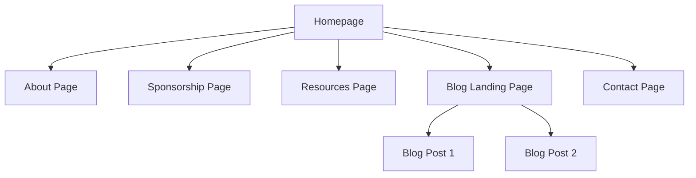
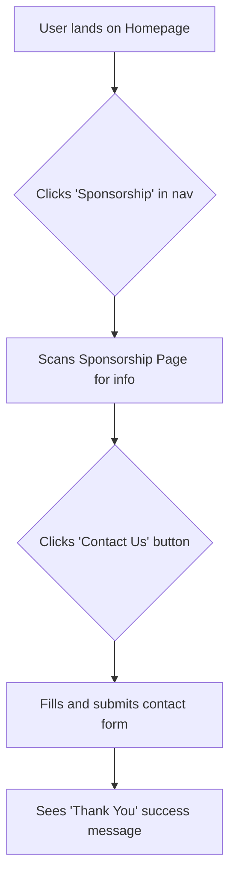
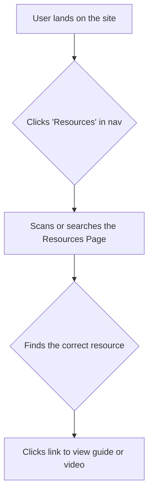

# Reprogrammed Team Website UI/UX Specification

### **Introduction**

This document defines the user experience goals, information architecture, user flows, and visual design specifications for the Reprogrammed Team Website. It serves as the foundation for visual design and frontend development, ensuring a cohesive and user-centered experience.

#### **Overall UX Goals & Principles**

- **Target User Personas**:

  - **Primary**: Team Members & Sponsors who need efficient access to resources and sponsorship information.
  - **Secondary**: The School Community & other FTC Teams who are interested in the team's progress and knowledge.

- **Usability Goals**:

  - **Efficiency**: Visitors, especially potential sponsors, should be able to find key information within one minute of arriving on the site.
  - **Ease of Use**: Team members should be able to locate resources significantly faster than with the current system of emails and group chats.

- **Core Design Principles**:

  1.  **Clarity First**: The design will prioritize clear, intuitive navigation and straightforward content presentation over complex or clever aesthetics.
  2.  **Professional & Engaging**: The visual style must be professional to build credibility with sponsors, yet engaging and modern to appeal to student members.
  3.  **Simplicity**: Avoid clutter. Each page should be designed to guide the user to a specific goal without overwhelming them with unnecessary information.

---

### **Information Architecture (IA)**

This section outlines the structure and organization of the website. It serves as a map to ensure that all content is organized logically and is easy for users to find.

#### **Site Map / Screen Inventory**

This diagram shows the primary pages of the website and how they relate to each other.

#### **Navigation Structure**

- **Primary Navigation**: The main navigation bar, visible on all pages, will contain the following links: **About**, **Sponsorship**, **Resources**, **Blog**, and **Contact**.
- **Secondary Navigation**: Not required for the MVP, as the site structure is flat and straightforward.
- **Breadcrumb Strategy**: Breadcrumbs will be used on blog posts to help users understand their location (e.g., `Home > Blog > [Post Title]`).

---

### **User Flows**

#### **Sponsor Inquiry Flow**

- **User Goal**: A potential sponsor wants to learn about the team and inquire about providing support.
- **Entry Points**: Direct link, search engine, link from team's social media.
- **Success Criteria**: The user successfully submits the contact form with their inquiry.

##### **Flow Diagram**

- **Edge Cases & Error Handling**:
  - If the contact form submission fails, a clear error message is displayed asking the user to try again.

---

#### **Team Member Resource Access**

- **User Goal**: A team member needs to find a specific build guide or tutorial video.
- **Entry Points**: Direct link to the site, bookmark.
- **Success Criteria**: The team member finds and successfully accesses the desired resource.

##### **Flow Diagram**

- **Edge Cases & Error Handling**:
  - If an external link to a guide or video is broken, the user will see the standard browser error or a 404 page from the destination site.

---

### **Wireframes & Mockups**

- **Primary Design Files**: In place of a formal design tool, this specification will use text-based descriptions to outline the content and structure of key pages.

#### **Key Screen Layouts**

- **Homepage**
  - **Purpose**: To provide a compelling introduction to the team and guide visitors to the most important sections.
  - **Key Elements (in order from top to bottom)**:
    1.  **Navigation Bar**: With links to the primary pages.
    2.  **Hero Section**: A large, engaging image of the team or robot, with the team name and a short, impactful tagline.
    3.  **About Blurb**: A brief, one-paragraph summary of the team's mission.
    4.  **Current Sponsors**: A section to display the logos of current sponsors.
    5.  **Sponsor Call-to-Action**: A visually distinct section that encourages visitors to learn more about sponsorship.
    6.  **Latest News**: A section displaying the 2-3 most recent blog post titles.
    7.  **Footer**: With contact info and social media links.

---

### **Component Library / Design System**

- **Design System Approach**: We will use and customize Docusaurus's built-in 'Infima' styling framework and component system. This approach is highly efficient, as it leverages the existing, robust components that come with the template, avoiding the need to build a design system from scratch.

#### **Core Components**

Below are the foundational components we will rely on for the MVP. Most are provided by the Docusaurus theme.

- **Navigation Bar**

  - **Purpose**: The primary site header for navigation.
  - **States**: Standard.

- **Button**

  - **Purpose**: Used for primary calls-to-action (e.g., "Contact Us") and other interactive elements.
  - **States**: Default, Hover, Disabled.

- **Card**

  - **Purpose**: To display summarized content, such as blog post previews or individual resources.
  - **States**: Standard, Hover.

- **Footer**

  - **Purpose**: The primary site footer containing contact information and links.
  - **States**: Standard.

---

### **Branding & Style Guide**

#### **Visual Identity**

- **Brand Guidelines**: The visual identity will be anchored by the official team logo provided.

#### **Color Palette**

| Color Type      | Hex Code  | Usage                                 |
| :-------------- | :-------- | :------------------------------------ |
| Primary         | `#242E6B` | Main headings, links, primary buttons |
| Secondary       | `#C1A5F3` | Secondary design elements, highlights |
| Accent          | `#FBC941` | Calls-to-action, important notices    |
| Neutral (Dark)  | `#212529` | Body text for high readability        |
| Neutral (Light) | `#FDF5E4` | Page backgrounds, card backgrounds    |
| Success         | `#198754` | Confirmation messages                 |
| Error           | `#DC3545` | Error messages                        |

#### **Typography**

- **Font Families**: To complement the classic serif font in your logo, we recommend using it for main headings (**Playfair Display** is a close free alternative). For body text, a clean and readable sans-serif font like **Inter** or **Source Sans Pro** will provide a modern and accessible reading experience.
- **Type Scale**: A standard typographic scale will be used for a clear visual hierarchy.

#### **Iconography**

- **Icon Library**: We will use a modern, open-source icon library like Material Symbols or Feather Icons for any required icons.

#### **Spacing & Layout**

- **Spacing Scale**: A consistent spacing scale based on an 8-point grid system will be used for all margins, padding, and layout to ensure a clean and organized appearance.

---

### **Accessibility Requirements**

#### **Compliance Target**

- **Standard**: The website will adhere to the **Web Content Accessibility Guidelines (WCAG) 2.1, Level AA**.

#### **Key Requirements**

- **Visual**:
  - **Color Contrast**: The chosen color palette must be tested to ensure sufficient contrast.
  - **Focus Indicators**: All interactive elements must have a clear and visible focus state.
- **Interaction**:
  - **Keyboard Navigation**: The entire website must be fully navigable using only a keyboard.
  - **Screen Reader Support**: Content will be structured semantically to be properly understood by screen readers.
- **Content**:
  - **Alternative Text**: All meaningful images must have descriptive "alt text".
  - **Heading Structure**: All pages must use a logical heading structure (H1, H2, H3, etc.).

#### **Testing Strategy**

- A combination of automated tools and manual testing will be used to validate accessibility.

---

### **Responsiveness Strategy**

#### **Breakpoints**

| Breakpoint | Min Width | Target Devices                          |
| :--------- | :-------- | :-------------------------------------- |
| Mobile     | (default) | Most smartphones                        |
| Desktop    | 997px     | Tablets in landscape, laptops, desktops |

#### **Adaptation Patterns**

- **Layout Changes**: Content will be displayed in a single, vertical column on mobile screens.
- **Navigation Changes**: The main navigation menu will collapse into a "hamburger" icon on mobile.

---

### **Animation & Micro-interactions**

#### **Motion Principles**

- **Subtle and Purposeful**: Animations will be used sparingly to provide feedback, not to distract.
- **Performance First**: All animations must be lightweight and optimized.
- **Accessible**: We will respect the `prefers-reduced-motion` browser setting.

#### **Key Animations**

- **Hover States**: Links and buttons will have a subtle transition effect on hover.
- **Page Transitions**: A simple and quick fade effect will be applied between page loads.

---

### **Performance Considerations**

#### **Performance Goals**

- **Page Load**: The website will aim for "Good" scores across all of Google's Core Web Vitals.
- **Interaction Response**: User inputs should feel instantaneous.

#### **Design Strategies**

- **Image Optimization**: All images must be compressed and appropriately sized before being added to the project.
- **Leverage Framework Features**: We will rely on Docusaurus's built-in performance features.

---

### **Next Steps**

#### **Immediate Actions**

1.  Finalize and approve this UI/UX Specification.
2.  Gather all final brand assets (logo files, final hex codes for colors) to provide to the development team.
3.  Proceed to the next agent, the **Architect**, who will use this specification and the PRD to create the technical architecture document.

#### **Design Handoff Checklist**

- [x] All user flows documented
- [x] Component inventory complete
- [x] Accessibility requirements defined
- [x] Responsive strategy clear
- [x] Brand guidelines incorporated
- [x] Performance goals established

### **Checklist Results**

This document has been systematically created following the `front-end-spec-tmpl` template, ensuring all key areas of the user experience have been considered and planned for.
