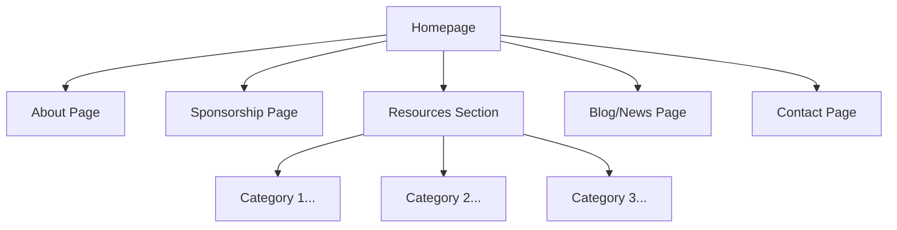
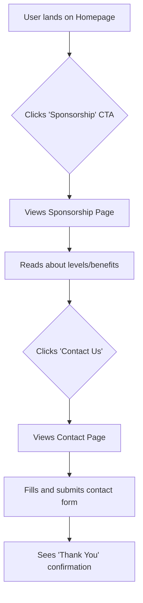
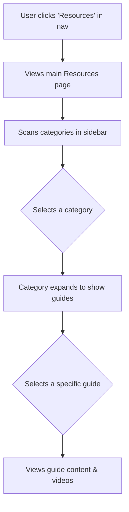

# Reprogrammed Team Website UI/UX Specification

### **Change Log**

| Date       | Version | Description                                        | Author            |
| :--------- | :------ | :------------------------------------------------- | :---------------- |
| 2025-08-16 | 1.0     | Initial draft created through interactive session. | Sally (UX Expert) |

### **Introduction**

This document defines the user experience goals, information architecture, user flows, and visual design specifications for the Reprogrammed Team Website's user interface. It serves as the foundation for visual design and frontend development, ensuring a cohesive and user-centered experience.

### **Overall UX Goals & Principles**

#### **Target User Personas**

- **Potential Sponsors & Partners**: Professionals who need to quickly assess the team's legitimacy, mission, and impact. They value clarity and professionalism.
- **Team Members & Mentors**: Students and adults who require an efficient, well-organized central hub for technical and organizational resources.
- **Community & Alumni**: A broader audience, including parents, other teams, and former members, who are interested in following the team's progress and staying connected.

#### **Usability Goals**

- **Efficiency**: Users can find the information they need (e.g., resources, sponsorship details) quickly and with minimal effort.
- **Clarity**: The website's structure and content are intuitive and easy to understand for all user groups.
- **Engagement**: The design is visually appealing and modern, encouraging exploration and reflecting the team's innovative spirit.

#### **Design Principles**

1.  **Professional & Innovative**: The design should project a clean, modern, and professional image that inspires confidence in sponsors while still feeling fun and innovative for students.
2.  **Clarity First**: Navigation and information hierarchy must be simple and intuitive. Prioritize clear communication over unnecessarily complex design.
3.  **Community-Focused**: Showcase the people behind the robot—members, mentors, and alumni—to build a personal connection with visitors.
4.  **Simple Storytelling**: The homepage should guide visitors through a narrative. This will be achieved through a clear sequence of content sections that use subtle, lightweight animations. This approach ensures an engaging experience that remains performant, accessible, and maintainable.

### **Information Architecture (IA)**

#### **Site Map / Screen Inventory**

This diagram shows the primary pages of the website and how they are organized.

#### **Navigation Structure**

- **Primary Navigation**: A persistent navigation bar at the top of the site will contain links to the main pages: About, Sponsorship, Resources, Blog, and Contact.
- **Secondary Navigation**: As detailed in the Project Brief, the "Resources" section will be a multi-page guide. It will feature its own sidebar navigation to allow users to easily browse through different categories of tutorials and guides.

### **User Flows**

#### **Flow: Become a Sponsor**

- **User Goal**: A potential sponsor wants to understand the benefits of sponsoring the team and find out how to make contact to proceed.
- **Entry Points**: Homepage (via a "Become a Sponsor" call-to-action button or Sponsor Showcase), Main Navigation.
- **Success Criteria**: The user understands the sponsorship levels and successfully submits the contact form to inquire about sponsoring.

**Flow Diagram**

**Edge Cases & Error Handling:**

- If the contact form fails to submit, a clear error message will be displayed asking the user to try again or providing an alternative contact method (like an email address).

#### **Flow: Find a Resource**

- **User Goal**: A team member needs to find a specific technical guide or tutorial to solve a problem or learn a new skill.
- **Entry Points**: Main Navigation ("Resources").
- **Success Criteria**: The user successfully navigates through the resource categories and finds the specific content they are looking for.

**Flow Diagram**

**Edge Cases & Error Handling:**

- If a user cannot find a specific resource, we can consider adding a "Request a Guide" feature in a future phase.
- Broken links will lead to a standard 404 "Page Not Found" page.

### **Wireframes & Mockups**

#### **Key Screen Layouts**

**Screen: Homepage**

- **Purpose**: To create an immediate "wow" moment that captures the team's innovative spirit, introduces the mission, and directs potential sponsors and community members to key content.
- **Key Elements**:
  - **Hero Section**: A large, visually engaging area at the top featuring the team logo and mission statement.
  - **Robot Spotlight**: A dedicated section to showcase the current robot.
  - **FTC Introduction**: A brief, engaging description of what the FIRST Tech Challenge is all about.
  - **Sponsor Showcase**: A component to prominently display the logos of team sponsors.
- **Interaction Notes**: The page will follow our "Simple Storytelling" principle. As the user scrolls, each section (Robot, Team, Sponsors) will fade or slide into view with subtle, lightweight animations to create a narrative experience.

**Screen: About the Team Page**

- **Purpose**: To share the team's mission and history, and to create a personal connection by showcasing the talented students, dedicated mentors, and successful alumni who make the team a community.
- **Key Elements**:
  - **Mission & History Section**: A concise section at the top of the page that clearly presents the team's mission statement and a brief history.
  - **Current Team Members Showcase**: A visually engaging grid or list of current student members. Each member would have a photo, their name, role on the team, and perhaps a short bio.
  - **Mentors Section**: A dedicated area to formally introduce and thank the team's mentors, highlighting their contributions and expertise.
  - **Alumni Spotlight**: A section to feature one or two notable alumni, sharing where they are now to demonstrate the long-term impact of the program.
- **Interaction Notes**: The page will be clearly divided into the sections above for easy scanning. A subtle hover effect on member/mentor photos could add a touch of interactivity.

**Screen: Sponsorship Page**

- **Purpose**: To provide potential sponsors with clear, compelling information about why and how they can support the team, making the decision and the process as simple as possible.
- **Key Elements**:
  - **Value Proposition**: A strong opening statement explaining the impact of sponsorship on the students and the community.
  - **Sponsorship Tiers**: A clear, easy-to-compare presentation (e.g., cards in a grid) of the different sponsorship levels, including the contribution amount and the benefits for each tier (logo on the robot, website, etc.).
  - **Team Needs**: A section that transparently outlines what sponsorship funds are used for (e.g., robot parts, competition travel, equipment) to build trust.
  - **Clear Call-to-Action (CTA)**: A prominent and unmistakable button or section that guides the user to the contact page to begin the sponsorship process.
- **Interaction Notes**: The layout should be clean and professional. The sponsorship tier cards could have a subtle highlight or shadow effect on hover to encourage interaction. The final CTA should be the most visually prominent element on the page.

**Screen: Resources Page**

- **Purpose**: To serve as a centralized, well-organized, and easily browsable library for all team-related technical guides, tutorials, and documents.
- **Key Elements**:
  - **Sidebar Navigation**: A persistent sidebar (a core feature of the Docusaurus docs plugin) will display an expandable, hierarchical list of all resource categories and the individual guide pages within them.
  - **Main Content Area**: A large, clean area optimized for readability that will display the content of the selected guide. This area must support text, images, code snippets, and embedded videos.
  - **Breadcrumb Navigation**: A breadcrumb trail at the top of the main content area (e.g., `Resources > Programming > Java Basics`) to help users easily understand their location within the documentation.
- **Interaction Notes**: Clicking a category in the sidebar will expand it to show the available guides. The sidebar will scroll independently of the main content and will highlight the currently active page.

**Screen: Blog Page (List View)**

- **Purpose**: To display a reverse-chronological list of all team news and updates, allowing visitors to easily see the latest posts and browse through the team's history.
- **Key Elements**:
  - **Post Previews**: A list of blog posts, where each item displays the post title, publication date, author, and a short excerpt.
  - **"Read More" Link**: A clear link on each preview to navigate to the full post.
  - **Pagination**: Controls at the bottom of the page (e.g., "Next Page," "Previous Page") to navigate through older entries.
- **Interaction Notes**: The layout will be a clean, scannable list. Clicking on a post's title or its "Read More" link takes the user to the detail view for that specific post.

**Screen: Blog Post (Detail View)**

- **Purpose**: To present the full content of a single blog post in a clear, readable format.
- **Key Elements**:
  - **Post Header**: The full title of the post, along with the author's name and the publication date.
  - **Main Content Area**: The body of the article, formatted for readability with support for text, images, and embedded media.
  - **Post Navigation**: Links at the bottom of the page to navigate to the "Previous" and "Next" articles in the series.
- **Interaction Notes**: This will be a single-column layout to keep the reader focused on the content without distractions.

### **Component Library / Design System**

**Design System Approach**: We will customize the existing components provided by the Docusaurus classic theme. This ensures we leverage the framework's built-in functionality and accessibility while applying the team's unique brand and style.

#### **Core Components**

**Component: Button**

- **Purpose**: To be used for all clickable actions, such as submitting a form or navigating to another page (e.g., "Become a Sponsor," "Read More").
- **Variants**:
  - **Primary**: For the most important calls-to-action (e.g., "Contact Us to Sponsor"). It should be visually prominent.
  - **Secondary**: For less critical actions (e.g., "View All Blog Posts").
- **States**: The button must have clear visual styles for its different states: `default`, `hover`, `disabled`.

**Component: Member Card**

- **Purpose**: To consistently display information for a student, mentor, or alumnus on the "About the Team" page.
- **Variants**: The card design should be flexible enough to handle slight variations for current members (showing their role) and alumni (showing their current university or company).
- **States**: The card should have a `default` state and a `hover` state (e.g., a subtle shadow or border appears) to provide visual feedback.
- **Usage Guidelines**: These cards will be arranged in a grid. Each card must contain a photo, the person's name, and a short line of text for their role or status.

**Component: Sponsor Showcase**

- **Purpose**: To professionally display sponsor logos on the Homepage and Sponsorship page.
- **Variants**: We may need different size variants for the logos based on sponsorship tiers (e.g., larger logos for higher-tier sponsors).
- **States**: Each logo should have a `default` state and a `hover` state (e.g., the logo might brighten or a tooltip with the sponsor's name could appear).
- **Usage Guidelines**: Logos should be high-quality and link directly to the sponsor's website. They will be arranged in a dedicated section on the Homepage.

### **Branding & Style Guide**

#### **Visual Identity**

- **Brand Guidelines**: The visual style will be a "dark theme" using a deep gray/purple base, with vibrant purple and yellow as primary and accent colors to create a modern, innovative, and engaging feel.

#### **Color Palette**

| Color Type | Hex Code  | Usage                                                                                                |
| :--------- | :-------- | :--------------------------------------------------------------------------------------------------- |
| Primary    | `#9B59B6` | The main brand purple, used for primary buttons and links.                                           |
| Accent     | `#F1C40F` | A bright, energetic yellow for important highlights and call-to-actions.                             |
| Success    | `#2E8540` | Positive feedback, confirmations.                                                                    |
| Warning    | `#FFBF00` | Cautions, important notices.                                                                         |
| Error      | `#BF212F` | Errors, destructive actions.                                                                         |
| Neutral    | `#1A1A1D` | A dark, charcoal gray for the main background, with lighter off-white text (`#EFEFEF`) for contrast. |

#### **Typography**

- **Font Families**:
  - **Primary**: "Roboto" (A clean, versatile, and highly readable sans-serif for all body text).
  - **Secondary**: "Exo 2" (A slightly futuristic, geometric sans-serif for headings to add an innovative feel).
- **Usage**: We will use a standard type scale with clear hierarchy for headings (H1, H2, H3) and paragraphs to ensure readability.

### **Accessibility Requirements**

#### **Compliance Target**

- **Standard**: The website must meet **WCAG 2.1 Level AA** compliance.

#### **Key Requirements**

- **Visual**:
  - **Color Contrast**: All text must have sufficient color contrast against its background to be readable, especially with our new purple and yellow theme.
  - **Focus Indicators**: There must be a clear and visible indicator showing which element is currently selected when navigating with a keyboard.
- **Interaction**:
  - **Keyboard Navigation**: All interactive elements (links, buttons, forms) must be fully usable with only a keyboard.
  - **Screen Reader Support**: The site will use proper semantic HTML (e.g., `<nav>`, `<main>`, `<h1>`) so that screen readers can correctly interpret the page structure.
- **Content**:
  - **Alternative Text**: All meaningful images must have descriptive "alt text" for users who cannot see them.
  - **Form Labels**: All form fields (like on the contact page) must have clear, properly associated labels.

#### **Testing Strategy**

- We will use a combination of automated tools (like the Lighthouse or Axe accessibility checkers built into web browsers) and manual testing (such as trying to navigate the site using only the Tab key) to ensure these requirements are met.

### **Responsiveness Strategy**

#### **Breakpoints**

We will use the standard breakpoints provided by the Docusaurus framework. It primarily uses a single breakpoint to differentiate between mobile/tablet and desktop views, which simplifies development and ensures consistency.

| Breakpoint | Width     | Target Devices                             |
| :--------- | :-------- | :----------------------------------------- |
| Mobile     | \< 996px  | All mobile phones and most tablets         |
| Desktop    | \>= 997px | Laptops, desktop computers, larger tablets |

#### **Adaptation Patterns**

- **Layout Changes**: On mobile screens, the layout will convert to a single-column view to prioritize content readability. Sidebars, like the one in the Resources section, will be accessible via a toggle button.
- **Navigation Changes**: The main navigation bar at the top of the site will automatically collapse into a "hamburger" menu on mobile devices.
- **Touch Targets**: All buttons and interactive links will have a large enough touch target area to be easily tappable on mobile screens.

### **Animation & Micro-interactions**

#### **Motion Principles**

- **Purposeful Motion**: Animations should have a clear purpose, such as guiding attention to a new section or providing feedback that an action was successful.
- **Performance First**: All animations must be lightweight and smooth. We will prefer CSS-based animations to ensure they don't slow down the site.
- **Subtle & Quick**: Motion should be subtle and fast to feel responsive and professional, not slow or distracting.

#### **Key Animations**

- **Section Reveal on Scroll**: As a user scrolls down a page (especially the Homepage), content sections will gently fade or slide into view. This will be a subtle effect to support our "Simple Storytelling" goal.
- **Interactive Hover Effects**: Buttons, cards, and links will have a subtle visual change on hover (e.g., a slight lift or a change in color) to indicate that they are interactive.

### **Performance Considerations**

#### **Performance Goals**

- **Page Load**: The site should be highly performant with fast page load times, aiming to meet Google's Core Web Vitals for a "Good" user experience.
- **Interaction Response**: All user interactions, like clicks and hover effects, should feel immediate and responsive.
- **Animation FPS**: All animations will be optimized to run smoothly at 60 frames per second.

#### **Design Strategies**

- **Image Optimization**: All photos (of the team, robot, etc.) will be compressed and optimized for the web to ensure they load quickly without sacrificing quality.
- **Code Minification**: The Docusaurus build process automatically handles the minification of code, which is a key performance best practice.
- **Lazy Loading**: Images that are not immediately visible on the screen will be "lazy-loaded," meaning they will only load as the user scrolls down to them.

### **Next Steps**

#### **Immediate Actions**

1.  This UI/UX Specification document should be reviewed and approved by the team's key stakeholders.
2.  The visual design process can now begin in a tool like Figma, using this document as the guide.
3.  The final, approved specification is ready for handoff to the Architect to create the detailed `front-end-architecture.md` document.
4.  The team should finalize the content categories for the "Resources" section sidebar.

#### **Design Handoff Checklist**

- [x] All user flows documented
- [x] Component inventory complete
- [x] Accessibility requirements defined
- [x] Responsive strategy clear
- [x] Brand guidelines incorporated
- [x] Performance goals established
